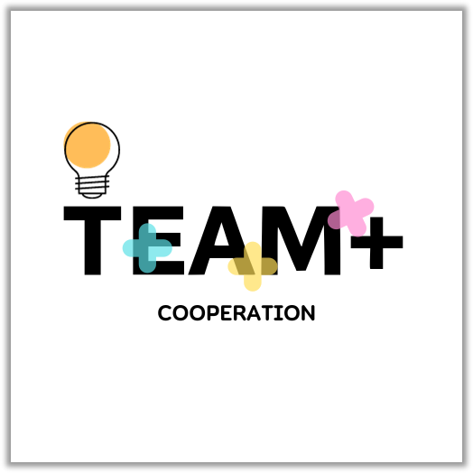

# 이력서

## 소개


- 이름: 홍승희
- 취미: **홈코딩**, 여행, 카페, 노래방
- Email: seung0476@gmail.com
- GitHub: [github.com/HongSeungHee25](https://github.com/HongSeungHee25)
- portfolio: [https://hongseunghee25.github.io](https://hongseunghee25.github.io)

```
개발자로서의 마음가짐은 새로운 기술과 도구에 대한 열린 태도를 유지하고, 실패를 두려워하지 않는 것입니다.
```


## Git Ladders


[](https://github.com/HongSeungHee25/github-readme-activity-graph)

## 교육 활동
- ㈜코리아IT아카데미 - (과정평가형)정보처리산업기사 취득과정A(2023.04 ~ 2023.11)
- SBS아카데미 컴퓨터아트학원(2018.08 ~ 2021.03)

## 최종 학력
- 수원전산여자고등학교(2016 ~ 2019)

## 사용 기술
### Backend
-  
-  
- 

### Frontend
- 
-  
-  
- 

### 그 외 기타
- 
- 
- 
- 

## 프로젝트 이력



### 팀워크의 혁신 - TeamPlus
- 소개: TEAM PLUS(팀 플러스)는 혁신적인 팀 협업 플랫폼으로서, 프로젝트 작업 시 팀원 간의 협력을 위한 플랫폼
- TeamPlus 주요 기능 : 회원 관리 및 SNS 로그인, TeamProject 관리, Team R&R 관리, 개인 TODO 관리
- 기간 : 2023.09.27-2023.현재
- 관련기술 : Java, JavaScript, HTML, CSS, SQL, Gson, Kakao API, Google API, Naver API, JQuery, RESTful API, Simple Java Mail, Gradle
- 성과 : 2023 KIT 해커톤 제 1회 SW 및 AI 융합 공모전(참가 예정)


### SeekSeat - inGangnam
- 소개: 강남 인근 레스토랑의 체계적이고 편리한 예약을 제공하는 웹사이트
- SeekSeat 주요 기능 : 회원 관리, 강남 인근 음식점 검색, 사업자회원 매장 등록 및 메뉴 등록, 일반회원 맛집 공유 커뮤니티
- 기간: 2023.08.25-2023.09.19
- 관련기술 : Java, JavaScript, JSP, CSS, SQL, Gson, Kakao API, Simple Java Mail, Maven


### SOULCAR
- 소개: 보다 편리한 렌트 서비스 제공 GUI
- SOULCAR 주요 기능 : 회원 관리, 차량 등급별 확인 및 실시간 예약 , 관리자 차량 등록 및 차량 검사 등록
- 기간: 2023.07.03-2023.07.21
- 관련기술: Java, Swing, SQL

----

여기까지 읽어주셔서 감사합니다. <br/>
부족한 부분이나 더 궁금하신 내용이 있다면 seung0476@gmail.com 으로 연락주세요.<br/>
감사합니다.
