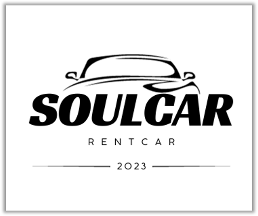

# 이력서
[](http://makeapullrequest.com)


## 소개


- 이름: 홍승희
- 취미: **홈코딩**, 여행, 카페, 노래방
- Email: seung0476@gmail.com
- GitHub: [github.com/HongSeungHee25](https://github.com/HongSeungHee25)
- portfolio: [https://hongseunghee25.github.io](https://hongseunghee25.github.io)

```
개발자로서의 마음가짐은 새로운 기술과 도구에 대한 열린 태도를 유지하고, 실패를 두려워하지 않는 것입니다.
```


## Git Ladders


[](https://github.com/HongSeungHee25/github-readme-activity-graph)

## 교육 활동
- ㈜코리아IT아카데미 - (과정평가형)정보처리산업기사 취득과정A(2023.04 ~ 2023.11)
- SBS아카데미 컴퓨터아트학원(2018.08 ~ 2021.03)

## 최종 학력
- 수원전산여자고등학교(2016 ~ 2019)

## 사용 기술
### Backend
-  
-  
- 

### Frontend
- 
-  
-  
- 

### 그 외 기타
- 
- 
- 
- 

## 프로젝트 이력


### 팀워크의 혁신 - TeamPlus
- 소개: 합법적으로, 공짜로, 누구나 웹툰을 볼 수 있도록 도와주는 서비스
- 사이드 프로젝트로 혼자 서버/백엔드 개발
- 기간 : 2019.01 ~ 2019.12
- 매출 : 8,709,411원


### SeekSeat - inGangnam
- 소개: 1등 전자책 서비스
- 기간: 2018.09 ~ 2020.09
- 프로젝트 : 리디페이퍼(3세대) 앱 개발, 웹툰/웹소설용 기능 추가, 유지보수



### SOULCAR
- 소개: 경매로 내차팔기 서비스
- 기간: 2017.07 ~ 2018.09
- 역할: 유지보수, 신규기능 개발
- 관련기술: MVP, rxJava, databinding, lint, Travis, Fabric, SharedElement Transition, Canvas

## 수상 경력
취미로 해커톤을 종종 나가곤 합니다. <br/>
**프로젝트에 도입해볼까?** 하는 신기술들을 <br/>
해커톤에서 간단하게 적용해보고 프로젝트에 도입해보곤 합니다.

### KakaoMobilityXGCP Cloud Hero - 사내 3위
- 수상 날짜 : 2023년 05월
 
#### 세종대학교 메이커톤 2020 - 우수상
- 수상 날짜 : 2020년 12

#### 서울 스타트업 윅엔드 2019 - Creativity(2위)
- 수상 날짜 : 2019년 11월

----

여기까지 읽어주셔서 감사합니다. <br/>
부족한 부분이나 더 궁금하신 내용이 있다면 seung0476@gmail.com 으로 연락주세요.<br/>
감사합니다.
